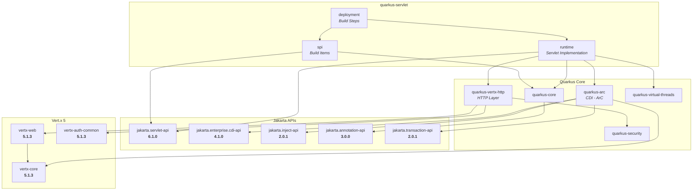

# Quarkus Servlet

Jakarta Servlet 6.1 implementation built directly on Vert.x 5 for Quarkus, designed as a drop-in replacement for the Undertow-based `quarkus-undertow` extension.

## Status

**Work in progress. Not yet a drop-in replacement for `quarkus-undertow`.**

The Jakarta Servlet 6.1 TCK runs with **no exclusions** and currently passes **1639 of 1714** tests
against a real Quarkus application - see [TCK](#tck) for where the remaining 75 sit.

That figure is deliberately the pessimistic one. The suite can also be driven against the servlet
runtime as a library, where it passes 1665, and that was the number this README quoted until the
harness was changed to boot Quarkus. It was flattering: the old harness re-implemented annotation
scanning, `web.xml` parsing and the entire context bootstrap in test code, so anything the harness
did for itself was something the extension was never asked to do. Booting Quarkus for real
immediately found seventeen gaps: two stopped an application from starting or building at all, one
left annotation-secured servlets open to anyone, and one meant no listener declared in a deployment
descriptor ever ran. Only the first number describes what ships.

Earlier revisions also quoted "857/857 passing"; that was the pass rate of a configuration that
excluded async, non-blocking I/O, HTTP upgrade, multipart, security and pluggability wholesale, so
it did not mean what it appeared to mean and has been removed.

What works today:

- Servlets, filters and listeners from annotations, `web.xml` and web fragments
- Async processing (`startAsync`, `complete`, `dispatch`) without blocking the event loop
- Per-servlet execution model: `@Blocking`, `@NonBlocking`, `@RunOnVirtualThread`
- Multipart uploads, non-blocking I/O (`ReadListener`/`WriteListener`), HTTP upgrade
- Declarative security: BASIC and FORM authentication, security constraints, `@ServletSecurity`
- CDI injection, `@SessionScoped`, Quarkus Security bridge, Dev UI
- Static resources, welcome files, error pages, request dispatching, sessions

Remaining gaps: FORM login, web-fragment ordering, HTTP request trailers (Vert.x exposes no API for
them), and assorted request-wrapper and async-dispatch edges. See
[How security is split](#how-security-is-split) for the division of labour on security.

## Architecture

Unlike `quarkus-undertow` which embeds the Undertow server as an intermediary, this extension implements the Servlet API directly on top of Vert.x 5's `HttpServerRequest`/`HttpServerResponse`. Requests are processed on the Vert.x event loop by default, with `@RunOnVirtualThread` available for servlets that need blocking I/O.

```
HTTP Request -> Vert.x Event Loop -> Servlet Handler -> Servlet (event loop by default)
                                                     -> Virtual Thread (opt-in via @RunOnVirtualThread)
```

## Dependency Diagram



## Performance

Reproduce with `perf-test/benchmark-wrk.sh`. Both implementations are built from this source tree
and run with identical JVM options; the numbers below are exactly what that script printed.

```
Date:        2026-08-05T21:13:18+10:00
System:      16 cores, 27 GiB RAM, OpenJDK 25.0.2
Load:        wrk, 100 connections, 4 threads, 15s x 3 runs, best of 3
Warm-up:     10s per endpoint, discarded
Server CPUs: 0-7      wrk CPUs: 8-11      JVM: -Xms512m -Xmx512m
```

| Endpoint | quarkus-servlet (Vert.x 5) | quarkus-undertow | Difference |
|---|---|---|---|
| `/plaintext` | **316,436 req/s** | 254,226 req/s | +24.5% |
| `/json` | **257,583 req/s** | 249,238 req/s | +3.3% |
| `/cdi` | **308,760 req/s** | 251,045 req/s | +23.0% |

**Latency (best run of each):**

| Endpoint | | p50 | p90 | p99 |
|---|---|---|---|---|
| `/plaintext` | quarkus-servlet | 232 us | 421 us | 2.89 ms |
| | quarkus-undertow | 316 us | 846 us | 2.50 ms |
| `/json` | quarkus-servlet | 275 us | 1.09 ms | 3.89 ms |
| | quarkus-undertow | 322 us | 870 us | 2.47 ms |
| `/cdi` | quarkus-servlet | 245 us | 426 us | 2.64 ms |
| | quarkus-undertow | 317 us | 880 us | 2.62 ms |

quarkus-servlet leads on throughput and on median latency; Undertow is more consistent in the p99
tail on two of the three endpoints. Note what this benchmark does and does not show: all three
endpoints are non-blocking servlets returning a static payload, which is the best case for
event-loop execution. A servlet doing real blocking work needs `@Blocking`, and that thread hand-off
costs throughput - benchmark your own workload before assuming these ratios carry over.

Earlier revisions of this README quoted figures (90,331 / 86,158 / 87,212 req/s) that no committed
result file supports, alongside a "wrk" methodology that the script did not actually implement. Both
have been replaced by the run above.

### Footprint

| | quarkus-servlet | quarkus-undertow |
|---|---|---|
| Runtime JARs | **1 JAR (136 KB)** | 5 JARs (1.6 MB) |
| Total app size | **19 MB** | 20 MB |
| Total JAR count | **109** | 113 |

quarkus-servlet is 12x smaller in runtime library footprint. Undertow requires 5 JARs (HTTP core, servlet adapter, Vert.x backend bridge, and Quarkus integration), while quarkus-servlet is a single 136 KB JAR that implements the Servlet API directly on the Vert.x APIs already present in Quarkus.

## Threading Model

Each servlet runs on one of three execution models, chosen the same way as in other Quarkus
extensions such as `quarkus-rest` and `quarkus-smallrye-graphql`:

| Annotation | Runs on | Use when |
|---|---|---|
| `@NonBlocking` | Vert.x event loop | the servlet never blocks |
| `@Blocking` | worker thread | the servlet blocks (JDBC, file I/O, `Thread.sleep`) |
| `@RunOnVirtualThread` | virtual thread | blocking code that parks rather than pinning a thread |
| *(none)* | `quarkus.servlet.execution-model` | the deployment-wide default |

```java
@WebServlet(urlPatterns = "/blocking")
@Blocking
public class MyBlockingServlet extends HttpServlet {
    @Override
    protected void doGet(HttpServletRequest req, HttpServletResponse resp) throws IOException {
        String data = myDatabase.query("SELECT ...");   // safe on a worker thread
        resp.getWriter().write(data);
    }
}
```

The deployment-wide default is the event loop, which is the fastest but requires every unannotated
servlet to be non-blocking. Applications migrating from Undertow, where servlets always ran on
worker threads, will usually want:

```properties
quarkus.servlet.execution-model=worker
```

Async processing works under every execution model. `startAsync()` returns the request to the
container without blocking the calling thread, so completing or dispatching an `AsyncContext` from
another thread is safe even when the servlet ran on the event loop.

## Features

**Servlet Spec:**
- Servlets, filters, listeners (annotation and web.xml)
- Async dispatch (`AsyncContext`)
- Request dispatching (forward/include, named dispatchers)
- Session management (cookie and URL-based)
- Error pages (status code and exception type)
- Welcome files
- Static file serving with production caching
- Multipart file upload (`getParts()`, `getPart()`)
- Non-blocking I/O (`ReadListener`, `WriteListener`)
- HTTP Upgrade (`upgrade()`, `WebConnection`)
- `HttpServletMapping` and `ServletConnection`
- Declarative security (`<security-constraint>`, role-based access)

**Quarkus Integration:**
- CDI injection (`@Inject`) in servlets, filters, listeners
- `@SessionScoped` CDI context backed by `HttpSession`
- `@Inject HttpServletRequest`, `@Inject HttpServletResponse`, `@Inject HttpSession`
- Quarkus Security bridge (`getUserPrincipal()`, `isUserInRole()`, `login()`, `logout()`)
- `@RolesAllowed` and `@Inject SecurityIdentity` in CDI beans called from servlets
- Dev mode error pages with stack traces and route listings
- SPI build items for cross-extension integration (`ServletBuildItem`, `FilterBuildItem`, `WebMetadataBuildItem`, etc.)

**Configuration:**

| Property | Default | Description |
|---|---|---|
| `quarkus.servlet.context-path` | `/` | Servlet context path (build time) |
| `quarkus.servlet.execution-model` | `event-loop` | Default thread for servlets: `event-loop`, `worker` or `virtual-thread` |
| `quarkus.servlet.max-parameters` | `1000` | Maximum request parameters |
| `quarkus.servlet.disallowed-methods` | (none) | HTTP methods to reject with 405 |
| `quarkus.servlet.virtual-threads` | `false` | Deprecated; use `execution-model=virtual-thread` |

`quarkus.servlet.buffer-size` and `quarkus.servlet.default-charset` were previously documented but
had no effect, and have been removed pending a real implementation.

## TCK

The Jakarta Servlet 6.1 TCK runs with **no exclusions** (`tck/pom.xml`). Every test the suite ships
is executed, so the numbers below describe the implementation rather than a filter in front of it.

```bash
mvn verify -Dtck -pl tck                                  # boots a real Quarkus app per deployment
mvn verify -Dtck -pl tck -Dservlet.tck.container=direct   # drives the runtime library directly
```

The default boots Quarkus, so the headline number measures the extension as it actually ships. It
was not always so - see [Running the TCK against a real Quarkus
application](#running-the-tck-against-a-real-quarkus-application) for what changed and why.

**Current state: 1665 of 1714 passing, 49 errors, 8 skipped.**

That figure comes from the default container, which drives the servlet runtime directly. The same
suite run against a real Quarkus application - which is what actually ships - currently passes 1639;
see [Running the TCK against a real Quarkus application](#running-the-tck-against-a-real-quarkus-application)
for why the two differ and what the gap consists of.

For context, the 857-test figure quoted by earlier revisions of this README was the whole suite
*after* exclusions removed roughly half of it. The full suite is 1714 tests; it started at 727
errors when the exclusions came off.

Remaining failures, all genuine gaps:

| Area | Errors | Gap |
|---|---|---|
| `spec.security.*` | 38 | this harness runs no Quarkus security layer, so it cannot measure security at all - see below |
| `pluggability.fragment`, `aordering*`, `spec.pluggability.ordering` | 11 | web-fragment ordering (`<absolute-ordering>`, `<ordering>`) |
| `httpservletrequest40`, `httpservletresponse40` | 6 | HTTP request trailers |
| assorted | 18 | spread thinly |

Declarative security is implemented in the container itself (`ServletSecurityEnforcer`): BASIC
challenges with realm handling, FORM login through `j_security_check` with saved-request replay and
a session-id change on success, `<security-role-ref>` mapping, and `@ServletSecurity` annotations.
What remains there is `<deny-uncovered-http-methods>`, client-certificate authentication, and a few
FORM/BASIC edge cases.

### How security is split

**Quarkus authenticates; the servlet layer authorises.** This is the same division
`quarkus-undertow` uses, and it is a deliberate choice - the extension previously carried a second,
complete authentication stack of its own, and the two did not compose.

- **Authentication** is Quarkus's. `quarkus.http.auth.*` mechanisms verify the caller against
  whichever `IdentityProvider`s the application configured - a properties file, a database, LDAP.
  The extension does not own a user registry.
- **Authorisation** is `ServletSecurityPolicy`, a Quarkus `HttpSecurityPolicy`. It applies
  `<security-constraint>` and `@ServletSecurity` with servlet semantics: constraints are selected by
  url-pattern specificity rather than declaration order, ties are combined, an unchecked constraint
  opens a resource and a DENY-semantic empty role list closes it.

`ServletSecurityEnforcer` remains for the parts of `<login-config>` that have no Quarkus equivalent
- FORM login through `j_security_check` with saved-request replay - and `QuarkusIdentityStore`
feeds it from `IdentityProviderManager` so it draws on the same identities. Before that bridge,
`ServletIdentityStore` defaulted to `EMPTY` and container-level BASIC and FORM login rejected every
credential in every real application, however the application had configured its users.

Two things worth knowing if you are configuring this:

- The realm's users and roles are read when the realm is **built at runtime**, not during
  augmentation. Supplying them as build-time properties alone leaves the realm empty and every
  credential fails with `ELY01151: Evidence Verification Failed` - which looks like wrong passwords
  and is not.
- `@ServletSecurity` is scanned at build time and turned into constraints over the annotated
  servlet's own url-patterns. `httpMethodConstraints` cover the methods they name; the class-level
  `@HttpConstraint` covers the rest, expressed as a constraint that omits the named methods.

Request trailers are blocked upstream rather than merely unwritten: Vert.x 5's `HttpServerRequest`
exposes no trailer accessor at all. Response trailers are implemented.

Two settings are **capability declarations, not exclusions**: `crossContext` and `http2Push` are
false. Every test still runs; the TCK simply asserts the behaviour of a container that does not
offer those optional features. `ServletContext.getContext()` returning null is explicitly permitted
by the spec, Quarkus deploys a single application, and `quarkus-undertow` behaves the same way.

A per-test timeout (`tck/src/test/resources/junit-platform.properties`) makes an unimplemented
feature fail its test rather than hang the suite. `SEPARATE_THREAD` mode is required: the default
only reports a timeout after the test returns, so it cannot interrupt a thread blocked in a socket
read - which is exactly what a missing feature causes here.

### Running the TCK against a real Quarkus application

`QuarkusServletTckContainer` is an alternative Arquillian container that augments and starts a real
Quarkus application per deployment, so the TCK would cover the extension as shipped rather than the
runtime library alone:

```bash
mvn verify -Dtck -pl tck -Dservlet.tck.container=quarkus

# add -Dservlet.tck.trace=true to report each deployment's bootstrap/augment/start phases
# and the size of the model it resolved - the fastest way to tell which stage a failure is in
```

Each WAR is rearranged into a Quarkus application root (classes at the top, `web.xml` under
`META-INF`, static content under `META-INF/resources`, `WEB-INF/lib` jars added as indexed
application archives), then bootstrapped, augmented and started on a free port.

Two things this container has to get right about itself, both of which produced convincing-looking
"servlet bugs" when it got them wrong. It registers a `Servlet` in the Arquillian `HTTPContext`,
because that is where Arquillian derives the context root it injects as `@ArquillianResource URL`;
without it the TCK believes every application is deployed at the root, expects `getContextPath()`
to be empty and mis-parses `getRequestURL()`, and 37 tests fail for reasons that have nothing to do
with the container under test.

And in flattening the WAR, `jakarta.servlet` classes found in `WEB-INF/classes` are dropped.
Some TCK archives ship their own copies, and Servlet 6.1 10.7.2 forbids a web application's
classloader from overriding the container's API classes - a real container ignores them. Promoting
them to application classes instead gives two definitions of `jakarta.servlet.GenericServlet`, one
in the application classloader and one in its parent, and the deployment then fails with
`NoClassDefFoundError` naming a class that is demonstrably loadable.

**Current state: 1639 of 1714 passing, 75 errors.**

#### Why the application model is built by hand

Letting Quarkus derive the model from the `tck` module is what made this unbootable, because two
settings were in a bind where each fixed what the other broke:

| `QuarkusBootstrap.Mode` | Application model | Launch |
|---|---|---|
| `PROD` | correct - 179 deps, 31 MB; augments cleanly | **refused**: `createInitialRuntimeApplication()` rejects `NORMAL` launch mode |
| `TEST` | **270 deps** - drags in this module's whole test classpath | works |

Under `TEST` the extra 90-odd dependencies are the TCK harness and its signature-test tooling:
`sigtest-maven-plugin` (9 MB) and `org.netbeans.tools:ct-sym` (10.6 MB). Augmenting that exhausts
the heap, and not for want of sizing - 8 GB failed exactly as 3 GB did.

Two things that look like solutions but are not: `setTest(false)` does not shrink the model under
`TEST` mode, and `setExcludedDependencies` is a **no-op** here - excluding `servlet-tck-runtime`,
`sigtest-maven-plugin` and `ct-sym` by `ArtifactKey` left all three in the resolved model.

So the container stops deriving the model and describes it instead: a synthetic `WorkspaceModule`
whose output directory is the exploded WAR, with `quarkus-servlet` as its single application
dependency, resolved through `BootstrapAppModelResolver` and handed over via
`QuarkusBootstrap.Builder.setExistingModel(...)`. That bypasses project resolution entirely, so
`TEST` mode both launches and stays small - and it says what the application under test actually
consists of, rather than depending on scoping side effects to say it.

Four things worth knowing about the result:

- `quarkus-test-common` is in the model deliberately. `TEST` is the only launch mode that starts
  in-process, and ArC's test-only build steps register `io.quarkus.test.ActivateSessionContext`
  unconditionally in that mode; augmentation cannot index it otherwise. It brings the model to 227
  deps / 43 MB, which augments without trouble.
- `platform.quarkus.native.builder-image` is set as a build system property. `quarkus.native
  .builder-image` defaults to that placeholder and a platform BOM would normally supply it; a
  hand-built model imports no platform, so config validation fails before a single build step runs.
- Extensions resolve from the local repository, not the reactor, so `mvn install` has to have run
  before this container is used.
- Roughly 200 sequential augmentations run in one JVM without leaking or exhausting the heap, so
  the fallback of forking a process per deployment turned out not to be needed.

Useful context: `quarkus-undertow` has never faced any of this, because Quarkus does not run the
Servlet TCK against it - its tests are ordinary `QuarkusExtensionTest` cases where the JUnit
extension owns the bootstrap. The only Arquillian-driven TCK in the Quarkus tree is the CDI TCK,
which boots ArC standalone rather than a full Quarkus application. There was no in-tree precedent
to copy.

The default container (`-Dservlet.tck.container=direct`) now reports **73**, up from the 49 it held
before authentication moved to Quarkus. That is not a regression in the extension: the direct
harness runs no Quarkus security layer at all, so with container-level enforcement removed it can no
longer measure security, and its security suites fail. It remains useful for isolating
runtime-library behaviour and useless for security.

**It should be retired.** It is roughly a thousand lines of test code re-implementing annotation
scanning, `web.xml` parsing and the context bootstrap - a second implementation of the container
that can disagree with the shipped one, and did, for as long as it was the default. Keeping it
while the Quarkus container's number comes down is reasonable; keeping it indefinitely is how the
next flattering number gets produced.

#### What booting Quarkus immediately exposed

The point of this container is that the direct one flatters the implementation: it re-implements
annotation scanning, `web.xml` parsing and the whole context bootstrap in test code, then calls
`ServletRecorder.executeServletDirect` with CDI disabled. Anything the harness does for itself is
something the shipped extension is never asked to do. The first run against a real Quarkus
application found seventeen such gaps, every one of which would have hit a real application:

| Gap | What it did to an application |
|---|---|
| `<session-config>` applied through the spec-guarded `setSessionTimeout` | failed to boot |
| `ServletSecurityConstraint` had no getters for two constructor parameters | any `<security-constraint>` failed the **build** |
| `VertxServletContext` never given its deployment back-reference | every `getRequestDispatcher(...).forward(...)` failed |
| `META-INF/web-fragment.xml` never parsed | servlets declared by a library never deployed |
| No context-initialization window ever opened | every `addServlet`/`addFilter`/`addListener` threw `IllegalStateException` |
| `ServletContainerInitializer`s never run, `contextInitialized`/`contextDestroyed` never fired | the context lifecycle was simply absent |
| `sessionDestroyed` fired *after* invalidation, against 11.3.3 | the CDI session context threw on every `session.invalidate()` |
| `<login-config>` never read | the container had no idea a deployment wanted FORM or BASIC |
| FORM saved the interrupted request in a cookie, not the session | login sent the caller to a landing page instead of back |
| A library's `web-fragment.xml` did not make it an application archive | fragments in ordinary jars were still never read |
| `AsyncContext.dispatch()` assumed the request was an `HttpServletRequest` | `ClassCastException` on a plain `ServletRequestWrapper` |
| `<listener>` in web.xml never read | **every** declared `ServletContextListener`, `HttpSessionListener` and `ServletRequestListener` silently never ran |
| `getEffectiveMajorVersion`/`MinorVersion` reported the container's version | an application could not tell which descriptor rules applied to it |
| A servlet whose class failed to link took down the whole application | one broken servlet, and nothing starts |
| `@ServletSecurity` never scanned | a servlet secured only by annotation was **wide open** |
| `ServletIdentityStore` defaulted to `EMPTY` and nothing replaced it | container BASIC/FORM login rejected every credential |
| Servlets registered after the boot-time pass had no instance | 500 on first use, via forward or lazy init |

All seventeen are fixed in `runtime` and `deployment` rather than in the harness, which took this
container from **957 errors to 75** of 1714. Fragment support and the context lifecycle account
for most of it - the `pluggability` package alone went from 641 errors to 94 - and not one of the
seventeen cost the direct container a single test, which is precisely the point: they were
invisible to it.

What is still outstanding here, worst first:

| Area | Errors | Gap |
|---|---|---|
| `spec.security.secform` | 15 | **open defect**, below |
| `spec.async` | 9 | async dispatch edges |
| `servletcontext*` (four suites) | 10 | assorted context API |
| `spec.security` other | 7 | `<deny-uncovered-http-methods>`, client-cert |
| `httpservletrequest40`, `httpservletresponse40` | 6 | HTTP request trailers, blocked on Vert.x |
| `pluggability.fragment` | 3 | web-fragment ordering |
| remainder | ~25 | spread thinly, one or two per suite |

**The open defect in `secform`.** FORM login itself works: the caller is redirected to the login
page, posts to `j_security_check`, and is redirected back to the page originally requested. The
request *after* that redirect reaches the servlet and returns an empty body, and why is not yet
established. Two explanations were investigated and disproved, so do not start from either - it is
not a forward-versus-redirect difference (the TCK's own client logs `No redirection to login page
received`, so it expects the redirect Quarkus performs), and it is not a missing trusted identity
provider (`ElytronTrustedIdentityProvider` is present and reached).

These numbers are the honest measure of the extension as shipped.

Fragment support has one known limit: `<absolute-ordering>` and `<ordering>` are not implemented,
so fragments merge in the order their archives are visited. That decides which declaration wins
when two fragments configure the same name; it does not affect whether a fragment deploys. web.xml
still takes precedence over every fragment, which is enforced explicitly.

## Building

```bash
# Build (skip tests)
mvn clean install -DskipTests

# Run integration tests
mvn verify -pl integration-tests

# Run Jakarta Servlet 6.1 TCK against a real Quarkus application (no exclusions - expect
# failures, see the TCK section)
mvn verify -Dtck -pl tck

# Run performance benchmark
cd perf-test && ./benchmark-wrk.sh
```

CI (`.github/workflows/build.yml`) builds Quarkus main, runs the build and the integration tests,
and runs the TCK. The TCK job does not gate on a green suite - it is not green - but on the error
count not rising, via `.github/check-tck-errors.sh`. A permanently red required check teaches
people to ignore it; a baseline catches the thing actually worth catching, and says so out loud
when the count improves and the baseline should be lowered.

That check also asserts how many tests ran, which is not redundant. Booting ~200 Quarkus
applications in one JVM is heavy enough that the fork occasionally dies partway through, and a
truncated run reports *fewer* errors simply because it ran fewer tests - so on the error count
alone, a crashed suite looks like an improvement. This happened during development and very nearly
went unnoticed.

## Project Structure

```
quarkus-servlet/
  spi/                 - Build items for cross-extension integration
  runtime/             - Servlet implementation on Vert.x 5
  runtime-dev/         - Dev mode support (Dev UI, Dev MCP)
  deployment/          - Build-time processing (annotation scanning, web.xml parsing)
  tck/                 - Jakarta Servlet 6.1 TCK (custom Arquillian container)
  test-fragment-lib/   - A library declaring servlets in META-INF/web-fragment.xml, so the
                         integration tests meet fragments the way an application does
  integration-tests/   - Smoke tests, plus DeploymentDescriptorTest covering the descriptor and
                         context-lifecycle behaviour the TCK found missing
  perf-test/           - Performance comparison vs quarkus-undertow
  docs/                - User guide and reference documentation
```
