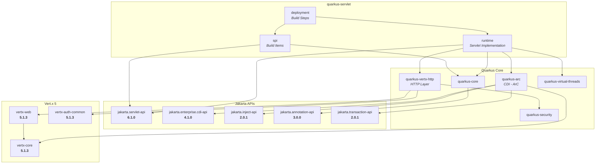

# Quarkus Servlet

Jakarta Servlet 6.1 implementation built directly on Vert.x 5 for Quarkus, designed as a drop-in replacement for the Undertow-based `quarkus-undertow` extension.

## Status

- **857/857 Jakarta Servlet 6.1 TCK** tests passing, zero failures
- **Full spec API coverage** - all `HttpServletRequest`/`HttpServletResponse` methods implemented (multipart, non-blocking I/O, HTTP upgrade, servlet mapping, servlet connection, declarative security)
- **Faster than Undertow** - 7-25% higher throughput depending on workload
- **Full Quarkus integration** - CDI, Security, `@SessionScoped`, Dev UI, Dev MCP

## Architecture

Unlike `quarkus-undertow` which embeds the Undertow server as an intermediary, this extension implements the Servlet API directly on top of Vert.x 5's `HttpServerRequest`/`HttpServerResponse`. Requests are processed on the Vert.x event loop by default, with `@RunOnVirtualThread` available for servlets that need blocking I/O.

```
HTTP Request -> Vert.x Event Loop -> Servlet Handler -> Servlet (event loop by default)
                                                     -> Virtual Thread (opt-in via @RunOnVirtualThread)
```

## Dependency Diagram



## Performance

Benchmark comparison against `quarkus-undertow` on the same Quarkus 999-SNAPSHOT build.

### Full hardware (16 cores, 61 GiB RAM)

100 concurrent connections, 15s per run, best of 3 runs. OpenJDK 21.0.11.

| Endpoint | quarkus-servlet (Vert.x 5) | quarkus-undertow | Difference |
|---|---|---|---|
| `/plaintext` | **90,331 req/s** | 83,087 req/s | +8.7% |
| `/json` | **86,158 req/s** | 68,840 req/s | +25.2% |
| `/cdi` | **87,212 req/s** | 81,713 req/s | +6.7% |

**Latency percentiles (plaintext):**

| Percentile | quarkus-servlet | quarkus-undertow |
|---|---|---|
| p50 | 1.10 ms | 1.10 ms |
| p90 | 1.70 ms | 1.30 ms |
| p99 | 3.50 ms | 3.00 ms |

### Cloud simulation (1 CPU / 512MB)

Simulated cloud pod using CPU pinning (`taskset`) and JVM memory limits (`-Xmx384m -XX:ActiveProcessorCount=1`). 50 concurrent connections, 15s per run, best of 3 runs.

| Endpoint | quarkus-servlet (Vert.x 5) | quarkus-undertow | Difference |
|---|---|---|---|
| `/plaintext` | **47,234 req/s** | 43,566 req/s | +8.4% |
| `/json` | **46,501 req/s** | 43,130 req/s | +7.8% |
| `/cdi` | **46,113 req/s** | 43,521 req/s | +6.0% |

On constrained hardware typical of cloud deployments, quarkus-servlet maintains a 6-8% throughput advantage. The Vert.x event-loop architecture scales down efficiently - a single event loop thread handles all I/O without the context-switching overhead of Undertow's thread pool.

### Footprint

| | quarkus-servlet | quarkus-undertow |
|---|---|---|
| Runtime JARs | **1 JAR (136 KB)** | 5 JARs (1.6 MB) |
| Total app size | **19 MB** | 20 MB |
| Total JAR count | **109** | 113 |

quarkus-servlet is 12x smaller in runtime library footprint. Undertow requires 5 JARs (HTTP core, servlet adapter, Vert.x backend bridge, and Quarkus integration), while quarkus-servlet is a single 136 KB JAR that implements the Servlet API directly on the Vert.x APIs already present in Quarkus.

## Threading Model

By default, servlets execute on the Vert.x event loop for maximum throughput. For servlets that perform blocking operations (database calls, file I/O, `Thread.sleep()`), annotate with `@RunOnVirtualThread`:

```java
@WebServlet(urlPatterns = "/blocking")
@RunOnVirtualThread
public class MyBlockingServlet extends HttpServlet {
    @Override
    protected void doGet(HttpServletRequest req, HttpServletResponse resp) throws IOException {
        // Safe to do blocking I/O here
        String data = myDatabase.query("SELECT ...");
        resp.getWriter().write(data);
    }
}
```

To run all servlets on virtual threads globally (without annotating each one):

```properties
quarkus.servlet.virtual-threads=true
```

## Features

**Servlet Spec:**
- 857/857 Jakarta Servlet 6.1 TCK passing
- Servlets, filters, listeners (annotation and web.xml)
- Async dispatch (`AsyncContext`)
- Request dispatching (forward/include, named dispatchers)
- Session management (cookie and URL-based)
- Error pages (status code and exception type)
- Welcome files
- Static file serving with production caching
- Multipart file upload (`getParts()`, `getPart()`)
- Non-blocking I/O (`ReadListener`, `WriteListener`)
- HTTP Upgrade (`upgrade()`, `WebConnection`)
- `HttpServletMapping` and `ServletConnection`
- Declarative security (`<security-constraint>`, role-based access)

**Quarkus Integration:**
- CDI injection (`@Inject`) in servlets, filters, listeners
- `@SessionScoped` CDI context backed by `HttpSession`
- `@Inject HttpServletRequest`, `@Inject HttpServletResponse`, `@Inject HttpSession`
- Quarkus Security bridge (`getUserPrincipal()`, `isUserInRole()`, `login()`, `logout()`)
- `@RolesAllowed` and `@Inject SecurityIdentity` in CDI beans called from servlets
- Dev mode error pages with stack traces and route listings
- SPI build items for cross-extension integration (`ServletBuildItem`, `FilterBuildItem`, `WebMetadataBuildItem`, etc.)

**Configuration:**

| Property | Default | Description |
|---|---|---|
| `quarkus.servlet.context-path` | `/` | Servlet context path |
| `quarkus.servlet.buffer-size` | `8192` | Output stream buffer size |
| `quarkus.servlet.max-parameters` | `1000` | Maximum request parameters |
| `quarkus.servlet.virtual-threads` | `false` | Run all servlets on virtual threads |
| `quarkus.servlet.disallowed-methods` | (none) | HTTP methods to reject with 405 |
| `quarkus.servlet.default-charset` | (none) | Default character encoding |

## Building

```bash
# Build (skip tests)
mvn clean install -DskipTests -pl spi,runtime,deployment

# Run integration tests
mvn verify -pl integration-tests

# Run Jakarta Servlet 6.1 TCK
mvn verify -Dtck -pl tck

# Run performance benchmark
cd perf-test && ./benchmark-wrk.sh
```

## Project Structure

```
quarkus-servlet/
  spi/                 - Build items for cross-extension integration
  runtime/             - Servlet implementation on Vert.x 5
  runtime-dev/         - Dev mode support (Dev UI, Dev MCP)
  deployment/          - Build-time processing (annotation scanning, web.xml parsing)
  tck/                 - Jakarta Servlet 6.1 TCK (custom Arquillian container)
  integration-tests/   - Basic smoke tests
  perf-test/           - Performance comparison vs quarkus-undertow
  docs/                - User guide and reference documentation
```
